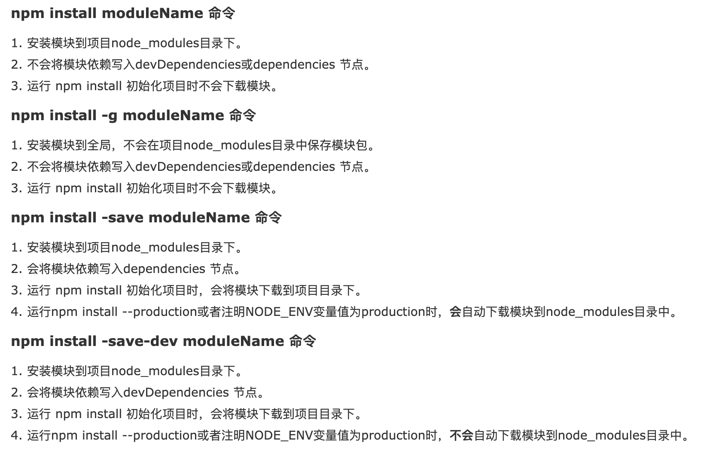

# TypeScript 工程环境构建

文档目录:

- [一. 使用Gulp构建TypeScript](#一-使用gulp构建typescript)
  - [1.1 Gulp 是啥](#11-gulp-是啥)
- [二. 构建一个简单工程](#二-构建一个简单工程)
  - [2.1 创建目录](#21-创建目录)
  - [2.2 初始化工程](#22-初始化工程)
  - [2.3 安装依赖项](#23-安装依赖项)
  - [2.4 简单示例](#24-简单示例)
  - [2.5 新建gulpfile.js 文件](#25-新建gulpfilejs-文件)

> 这里假设你已经在使用[Node.js](https://nodejs.org/) 和[npm](https://www.npmjs.com/) 了。

## 一. 使用Gulp构建TypeScript

### 1.1 Gulp 是啥

- [Gulp 官网](http://gulpjs.com/)

自动化和增强工作流程的工具包

利用gulp和JavaScript的灵活性来自动执行缓慢的重复性工作流，并将其组合为有效的构建管道。

特性：

- 灵活
- 可组合
- 高效

插件:

使用社区构建的插件是使用gulp的快速方法。每个插件都需要做少量的工作，因此您可以像构建模块一样连接它们。将来自各种技术的插件链接在一起，以达到您想要的结果。

自2013年以来，gulp已成为开发人员和设计师的首选工具包。自从一开始我们就不仅有依赖我们的社区，而且还有不断涌入的新用户，他们发现使用gulp可以大大提高工作流程的效率。

## 二. 构建一个简单工程

### 2.1 创建目录

创建一个新目录，如下所示：

```bash
#!/bin/bash
mkdir ts-demo
cd ts-demo
```

创建展开为如下工程目录:

```html
ts-demo/
   ├─ src/
   └─ dist/
```

TypeScript文件放在`src`文件夹下，经过TypeScript编译器编译生成的目标文件放在`dist`目录下;

```bash
mkdir src
mkdir dist
```

### 2.2 初始化工程

现在让我们把这个文件夹转换成npm包：

命令参考:



```node
npm init
```

你将看到有一些提示操作。 除了入口文件外，其余的都可以使用默认项。 入口文件使用 `./dist/main.js`。 你可以随时在 `package.json`文件里更改生成的配置。

修改 `package.json`文件:

```json
{
  "name": "ts-demo",
  "version": "1.0.0",
  "description": "the type script demo project",
  "main": "./dist/main.js",
  "dependencies": {
    "gulp-cli": "^2.2.0"
  },
  "devDependencies": {
    "gulp": "^4.0.2",
    "gulp-typescript": "^5.0.1",
    "typescript": "^3.9.3"
  },
  "scripts": {
    "test": "echo \"Error: no test specified\" && exit 1"
  },
  "author": "dvsnier",
  "license": "ISC"
}
```

### 2.3 安装依赖项

现在我们可以使用`npm install`命令来安装包。 首先全局安装`TypeScript`和`Gulp`。

```node
npm install -g gulp-cli
```

然后安装`typescript`，`gulp`和`gulp-typescript`到开发依赖项。 

> `Gulp-typescript`是TypeScript的一个Gulp插件。

```node
npm install --save-dev typescript gulp gulp-typescript
```

### 2.4 简单示例

在 `src`目录下创建`main.ts`文件：

```ts
function hello(compiler: string) {
    console.log(`Hello from ${compiler}`);
}
hello("TypeScript");
```

在工程的根目录`ts_demo`下新建一个`tsconfig.json`文件：

```json
{
    "files": [
        "src/main.ts"
    ],
    "compilerOptions": {
        "noImplicitAny": true,
        "target": "es5"
    }
}
```

### 2.5 新建gulpfile.js 文件

在工程根目录下，新建一个`gulpfile.js`文件：

```js
var gulp = require("gulp");
var ts = require("gulp-typescript");
var tsProject = ts.createProject("tsconfig.json");

gulp.task("default", function () {
    return tsProject.src()
        .pipe(tsProject())
        .js.pipe(gulp.dest("dist"));
});
```

运行命令:
```node
gulp
node dist/main.js
```

程序应该能够打印出“Hello from TypeScript!”。


